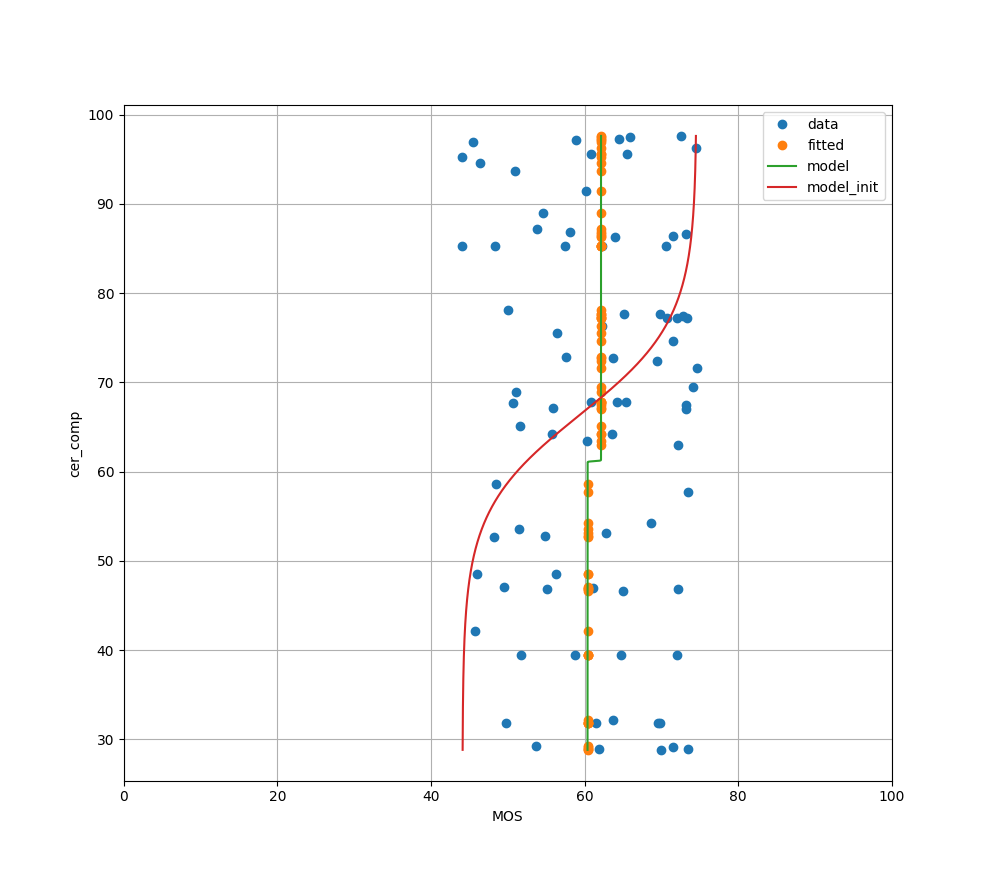
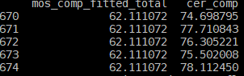

# Notes

Just some notes that don't belong in the README. 

# Datasets

## SCID
https://eezkni.github.io/publications/ESIM.html
paper: https://eezkni.github.io/publications/journal/ESIM/ESIM_ZKNI_TIP17.pdf

## CIQAD
https://sites.google.com/site/ciqadatabase/
paper: https://sci-hub.ru/10.1016/j.jvcir.2014.11.001
## SIQAD
https://sites.google.com/site/subjectiveqa/
paper: https://ieeexplore.ieee.org/stamp/stamp.jsp?tp=&arnumber=7180347

## Metrics

### MOS: Mean Opinion Score

Often between 1 and 5, but can be any number. In this case it seems like its between 0 and 100, or its normalized after.

### PSNR: Peak Signal to Noise Ratio

Used to measure the quality of reconstruction of lossy compression algorithms.
PSNR measures the ratio of the original image to the error (noise) in the reconstructed image.
So with the same image, a higher PSNR means that there is a lower error.

### CER: Character Error Rate 
Compares the total amount of characters to the minimum amount of insertions, deletions and substitutions needed to transform the recognized text into the ground truth text.

CES = (insertions + deletions + substitutions) / total characters

### Goal

Should the goal be to minimize the error or be as close as possible to the MOS?
An algorithm that recognizes text even if the human can't would be useless.
If we would use that as a metric for compression algorithms, the results might be images that humans can't read but computers can.
So the objective metric should be as close as possible to the MOS.
If we plot MOS vs. Metric we want to have a straight line.

## Text Recognition Algorithms

### Tesseract

https://github.com/tesseract-ocr/tesseract

paper: https://ieeexplore.ieee.org/document/4376991
but author only author until 2018

settings: https://tesseract-ocr.github.io/tessdoc/ImproveQuality.html

### Paddle OCR

https://github.com/PaddlePaddle/PaddleOCR
paper: https://arxiv.org/abs/2009.09941
python quickstart: https://github.com/PaddlePaddle/PaddleOCR/blob/release/2.6/doc/doc_en/quickstart_en.md
model summary: https://github.com/PaddlePaddle/PaddleOCR/blob/release/2.6/doc/doc_en/algorithm_overview_en.md
not sure yet how to use specific models

### Ocropus

https://github.com/ocropus/ocropy
no paper
seems to be experimental, not as stable

### Kraken OCR

https://github.com/mittagessen/kraken
paper: https://arxiv.org/ftp/arxiv/papers/1703/1703.09550.pdf

### Microsoft OCR

https://learn.microsoft.com/en-us/azure/cognitive-services/computer-vision/quickstarts-sdk/client-library?tabs=visual-studio&pivots=programming-language-python

### MMOCR

https://github.com/open-mmlab/mmocr

### Vedastr
https://github.com/Media-Smart/vedastr
small? but simple library

## Models

Maybe look for stuff here: https://huggingface.co/models?sort=downloads&search=ocr

### Mask OCR
https://paperswithcode.com/paper/maskocr-text-recognition-with-masked-encoder

## Datasets

### Applicable

- Paper http://smartviplab.org/pubilcations/SCID/zkni_TIP_ESIM_2017.pdf
    - Alternative Paper: https://ieeexplore.ieee.org/document/8266580
    - Dataset Download/Website http://smartviplab.org/pubilcations/SCID.html

- Paper https://arxiv.org/pdf/2008.08561.pdf
    - link is dead, contacted all 3 authors, no response

- CCT Dataset
    - https://sites.google.com/site/minxiongkuo/uca
### Not applicable

- https://sites.google.com/site/zhangxinf07/fg-iqa (FG-IQA)
    - not applicable, not screen content, nor text of any kind

- https://live.ece.utexas.edu/research/Quality/live_multidistortedimage.html
    - no text

### Not sure
- https://iopscience.iop.org/article/10.1088/1742-6596/1828/1/012033
    - http://cvbrain.cn/download/#
    - document image quality assessment
    - no reference images, that's fine
    - just document images, not screen content with MOS scores
- https://www.sciencedirect.com/science/article/abs/pii/S1296207417303382
    - no link to dataset found
    - might be applicable

## Annotations

Image annotation formats: [link](https://www.edge-ai-vision.com/2022/04/exploring-data-labeling-and-the-6-different-types-of-image-annotation/)

- Bounding boxes
    - Recognized text plus bounding box coordinates
    - Threshold margin separating different text elements
    - One bounding box for each element
    - left, top, right, bottom
    - either text elements or single characters, flexible
    - sometimes even curved bounding boxes
- Text
    - Recognized text
    - Confidence

Annotations from algorithms are similar, bbox + text. So it would be reasonable to adjust to the dataset.

## Other Literature

- https://paddleocr.bj.bcebos.com/ebook/Dive_into_OCR.pdf
    - OCR book

- https://engineering.fb.com/2018/09/11/ai-research/rosetta-understanding-text-in-images-and-videos-with-machine-learning/
    - Facebook paper on text recognition
    - rosetta

- https://research.aimultiple.com/ocr-technology/
    - current state of OCR

- https://ieeexplore.ieee.org/stamp/stamp.jsp?tp=&arnumber=156468
    - Historical Review of OCR Research and Development 
    - way too old, 1992

- https://ieeexplore.ieee.org/stamp/stamp.jsp?arnumber=9151144
    - Handwritten Optical Character Recognition (OCR): A Comprehensive Systematic Literature Review (SLR)
    - handwritten, but maybe still interesting, as there aren't many algorithms that are trained on screen content
- https://ieeexplore.ieee.org/stamp/stamp.jsp?tp=&arnumber=9183326
    - Text extraction using OCR: A Systematic Review
    - might be a good overview

### Distortions

1. Gaussian Noise (GN)

    
    

2. Gaussian Blur (GB)

    
    

3. Motion Blur (MB)

    
    

4. Contrast Change (CC)

    
    

5. JPEG Compression (JPEG)

    
    

6. JPEG2000 Compression (JPEG2000)

    
    

7. Color Saturation Change (CSC)

    
    

8. HEVC Screen Content Coding (HEVC-SCC)

    
    

9. Color Quantization Dither (CQD)

    
    

## schedule

| Month | Tasks |
| --- | --- |
| 1 | Choose a specific research question. Conduct a thorough literature review to understand the state-of-the-art in text recognition algorithms and MOS on compressed screen content data. |
| 2 | Collect and preprocess your dataset. Implement and compare different text recognition algorithms on the dataset.|
| 3 | Analyze the collected data and compare the performance of the text recognition algorithms against MOS. Draft the introduction and methodology chapters.|
| 4 | Evaluate the robustness and limitations of the text recognition algorithms and MOS data. Discuss the results and draw conclusions on the research question. Write Evaluation, identify what else is needed to explain results. |
| 5 | Refine the thesis chapters, including the discussion and conclusion. Draft the abstract and connect chapters. |
| 6 | Finalize the thesis and prepare for submission. Review and proofread the thesis. |

| Week | Tasks |
| --- | --- |
| 1 | Finalize plots, add more images/labels, get things in order, look for inconsistencies, Gliederung|
| 2 | Write evaluation, draw conclusions from all the plots/data, identify recurring themes?|
| 3 | Write supporting chapters, methodology, dataset labeling, metrics, codecs|
| 4 | Write introduction, abstract, conclusion, connect chapters |
| 5 | Look for inconsistencies, proofread, finalize thesis |
| 6 | Buffer |
| 7 | Buffer |
| 8 | Buffer |

maybe bad introduction first
## Random ideas
- Subjective metric should be comparison with original image, not absolute. Double stimulus.(for SCID dataset)
- Why not train a model to predict human score?

## Notes

- [x] add bounding boxes in ground truth, as detection is mentioned too in the task
    - use bounding boxes to run OCR on each box
    - plan
        - doesn't work, bounding boxes have different heights for bigger letters, gets messy
        - plus, bounding box definitions/thresholds are different for tesseract and easyocr
        - can mby use height of big letters to determine threshold for line
    - or use dameru levenshtein distance
        - would work, with "range" set to word
    - using full data representations, but just take text in the order given by the algorithm. Its the same order the direct string methods have, but I'm carrying more information.

- [x] check which for what images/compressions the correlation is high
    - need to color code the figures to differentiate between the different images, compressions and qualities
    - better to do subplots for each compression, too messy
    - need to check correlation values

- [x] some compressions (Contrast change/4) MOS not in "correct" order
    - it is actually correct
    - last time numbers/compressions were wrongly labeled

- [x] subplots for each compression

- [x] spearman ranked, pearson for each compresssion 
    - [x] for whole dataset
    - [x] table http://smartviplab.org/pubilcations/SCID/zkni_TIP_ESIM_2017.pdf

- [x] move fitting out of plotting file

- [x] do everything for tesseract too

- [x] comparison of gt vs pseudo gt
    - vtm/hm vs cer https://ieeexplore.ieee.org/stamp/stamp.jsp?tp=&arnumber=9747633
    - for VTM and HM: mean cer over all images, compare txt to
        - real gt (label uncompressed images yourself)
        - pseudo gt (run ocr on uncompressed images, use that as gt)
    - [x] need to make x-axis size of bitstream

- [x] fix label of the coin image

- [x] plot avg bitrate vs avg psnr
    - [x] might want to put everything into one dataframe
        - QPs, configs(scc, default), codec(HM, VTM)
        - then plot stuff

- [x] add labels/gt for all other images
    - images: 2, 6, 7, 8, 9, 11, 12, 13, 15, 16
    - did not included UI elements like > in navigation in gt
    - included double spaces in gt
    - really weird english in some images, should find out if ocr uses a dictionary, could impact performance

- [x] different config files for non-screen content codec
    - just loop over them, and save as two different plots

- [x] convert bmp images to png for latex
    - can do with convert, same as for RAW files for codec

- [x] need to change paths for visualizations

- [x] basic introduction and outline

- [x] absolute differenz pixel

- [x] cer implementation!!

- [x] computer readability for certain codecs config/level

- [x] keine abkürzungen in gliederung

- [x] write section for TER/CER and MOS
    - need to flesh out and add sources
    - add other common metrics (mentioned in the task as well)

- subj_fitted vs. subj
- [ ] check if tesseract performance correct, or if gt is "biased"
    - fixed, but some words are floating behind sentence, because their "top" starts slightly below

- [ ] add stds to means

- [ ] Bjøntegaard Delta Rate LMS
    - need more images, data not strictly increasing
    - might need to invert cer values, to make it increase with increasing bitrate 

- [x] reflect on all the data we have now
    - plots
    - tables/correlations
    - [x] check what questions i can answer with this data and what i still need

- [x] compare gt to ocr on reference images

- [x] compare ocr on reference images to ocr on compressed images

- [ ] figure out the inner workings of tesseract
    - when it fails, why does it fail?
    - what preprocessing is applied automatically?
    - still no result for some compressed images

- [ ] document quality assessment dataset; missing MOS? Check if in last package
    - scores are in last package, but still need to download all
    - need to connect first then unzip, .zip.001 to .zip.024 extensions
    - annoying to decompress
    - RAM leak

## Results

!!! add hypotheses, experiments, results, discussion, conclusion for each
hypothesis that certain distortions affect the performance of the OCR algorithm more

1. Research state-of-the-art text recognition and detection methods.

- easy ocr
    - simple neural network based (lstm)
- tesseract
    - google ocr engine
    - has lstm mode

2. Generate a labeled dataset to evaluate the efficiency of the researched algorithms
on screen content data.

- general difficulty to determine position/order of text elements
- easy ocr
    - Easy ocr generally performs well even on distorted images
    - for motion blur the performance is worse for the 2 worst quality levels for most images
    - image 4 performs better for worse quality, because gt doesn't contain text on coin
- tesseract

3. Available datasets with subjective quality scores will be utilized to investigate
the correlation between text recognition rates and human judgement.

- easy ocr
    - no clear correlation, ocr not getting substantially worse with worse quality
    - transformation via fitted model might help
- tesseract

<table>
<tr><th>EasyOCR</th><th>Tesseract</th></tr>
<tr><td>

|                          |   cer_fitted_ezocr |
|:-------------------------|-------------------:|
| ('pearson', 'CC')        |               0.37 |
| ('pearson', 'CQD')       |               0.38 |
| ('pearson', 'CSC')       |               0.07 |
| ('pearson', 'GB')        |               0.64 |
| ('pearson', 'GN')        |               0.09 |
| ('pearson', 'HEVC-SCC')  |               0.41 |
| ('pearson', 'JPEG')      |               0.6  |
| ('pearson', 'JPEG2000')  |               0.3  |
| ('pearson', 'MB')        |               0.83 |
| ('spearman', 'CC')       |               0.48 |
| ('spearman', 'CQD')      |               0.53 |
| ('spearman', 'CSC')      |               0.04 |
| ('spearman', 'GB')       |               0.6  |
| ('spearman', 'GN')       |               0.17 |
| ('spearman', 'HEVC-SCC') |               0.27 |
| ('spearman', 'JPEG')     |               0.37 |
| ('spearman', 'JPEG2000') |               0.24 |
| ('spearman', 'MB')       |               0.87 |

</td><td>

|                          |   cer_fitted_tess |
|:-------------------------|------------------:|
| ('pearson', 'CC')        |              0.29 |
| ('pearson', 'CQD')       |              0.37 |
| ('pearson', 'CSC')       |              0.19 |
| ('pearson', 'GB')        |              0.56 |
| ('pearson', 'GN')        |              0.87 |
| ('pearson', 'HEVC-SCC')  |              0.45 |
| ('pearson', 'JPEG')      |              0.38 |
| ('pearson', 'JPEG2000')  |              0.47 |
| ('pearson', 'MB')        |              0.61 |
| ('spearman', 'CC')       |              0.21 |
| ('spearman', 'CQD')      |              0.15 |
| ('spearman', 'CSC')      |              0.04 |
| ('spearman', 'GB')       |              0.49 |
| ('spearman', 'GN')       |              0.78 |
| ('spearman', 'HEVC-SCC') |              0.33 |
| ('spearman', 'JPEG')     |              0.23 |
| ('spearman', 'JPEG2000') |              0.45 |
| ('spearman', 'MB')       |              0.68 |

</td></tr> </table>

Observations:
- Tesseract aligns with human judgement better for images with gaussian noise, 0.09 ezocr vs 0.87 tess, similar for spearman ranked
- both do well for:
    - Gaussian Blur (GB) (0.64 ezocr vs 0.56 tess)
    - Motion Blur (MB) (0.83 ezocr vs 0.61 tess), spearman even higher (0.87 ezocr vs 0.68 tess)
        - might be because motion blur heavily distorts text
- the lowest correlations are for:
    - Color Quantization Dither (CQD) (0.38 ezocr vs 0.15 tess)
        - only really affects objects in the images, not text
    - Color Saturation Change (CSC) (0.07 ezocr vs 0.19 tess)
        - doesn't change much in regards to text readability but image looks worse
    - Gaussian Noise (GN) (0.09 for ezocr)
        - ezocr still performs well, even if the text is impaired

Conclusion:
Correlations are high when the distortion heavily affects the text, but low when the distortion doesn't.
    

4. Since most datasets do not contain textual ground truth information,
   investigate the feasibility of using recognized text from pristine images as ground truth instead.

    - hypothesis: should perform well, but position needs to be determined
    

True GT:

The image gets encoded with the corresponding codec and quality level.
The resulting image is then fed into the OCR algorithm.
The recognized text is then compared to the human label (true GT) and the prediction of the OCR algorithm  on the non-encoded image (pseudo GT). The resulting CER is plotted.

If the difference between the pseudo GT values of the comparing codecs is similar to the difference between the true GT values, the OCR algorithm might be good to use as a pseudo GT.
One can then use the OCR algorithm to create a GT without the need for human labeling. This pseudo GT can then be used to evaluate the performance of codecs, compared to each other.

Observations:
- the distance between true and pseudo GT is lower for ezocr than for tesseract
    - ezocr seems to be less affected by the distortions induced by the codecs
- ocr performance gets worse with higher QP, but only slightly
    - makes sense

Weirdness:

- I's are often missed

- Image 3:
    - has worse (higher) CER for QP 35 than for QP 45, so ocr performs better for worse quality
    - but pseudo GT CERs are strictly increasing with QP

|  QP |   CER_true_gt   | CER_pseudo_gt |
|----:|----------------:|--------------:|
|  35 |            0.173 |          0.002 |
|  40 |            0.178 |          0.015 |
|  45 |            0.170 |          0.039 |
|  50 |            0.181 |          0.073 |

- Tesseract stops detecting for gaussian noise 4 and 5 for all images ???

## Plots to generate
generally:
- ocr algorithms seperatly
- try to average over images, unless issues
### 1. Generate a labeled dataset | evaluate efficiency of ocr on screen content data.

- CER(against gt), seperate by dist type, highlight distortion quality, y(cer) x(qual)

### 2. Datasets with MOS used to check correlation between text recognition rates and human judgement.

- CER(against ref) vs mos, mos is relative to ref, subplot for every dist type, colormap for quality, maybe seperate and combine in latex
- CER_fitted(against ref) vs mos

- pearson, spearman table with different criteria: CER, CER_fitted (vs ref and gt)

### 3. most datasets do not have textual ground truth, investigate using recognized text from pristine images as gt.

- just check CER ref vs gt, average over all images, no plots

### 4. check how OCR performs for different quality levels for HEVC and VVC

- mby for both configs, show difference
- for both qual lists, check if performance loss with higher q
    - CER(against ref|pseudo), y(CER) x(qual/size), against ref how much worse it gets
    - CER(against gt|true), y(CER) x(qual/size), make absolute statement about how good OCR is
- bdRate, no plot needed

## Questions

- Multi letter variables straight, italic
- use HM/VTM or hevc/vvc? HM/VTM is the reference software, but hevc/vvc is the standard? --> HM/VTM
- difficult to always say "better performance of ocr on images with CC distortion", instead of "CC performs better"
- made images square, but font still too small in subplots, higher font --> destroys aspect ratio/layout
- fitting makes only sense when "transforming" the mos, as they are "wrong" because of human source (model(objvals) = mos, makes sense)
    - https://www.researchgate.net/profile/Guangtao-Zhai/publication/341011181_Perceptual_image_quality_assessment_a_survey/links/61812d24a767a03c14e3d754/Perceptual-image-quality-assessment-a-survey.pdf
    - review suggests differently, objective score gets converted
    - model is different as well (in original paper as well)
    - just fit model, then get correlation from model (doesn't matter which variable gets converted), its just to remove nonlinearity
    - references https://vqeg.org/VQEGSharedFiles/Publications/Validation_Tests/FRTV_Phase2/FRTV_Phase2_Final_Report.pdf (only 3 parameters)
    - what test plan to use from this https://www.vqeg.org/publications-and-software/
- overflow warning is most likely coming from numpy not handeling large negative numbers well, but its fine, just gets approximated to 0
    - https://stackoverflow.com/questions/40726490/overflow-error-in-pythons-numpy-exp-function
- optimize warning: covariance could not be estimated
    - suggestions that starting parameters are bad, but they should be correct (from paper)
- optimize warning: constant input
    - fitted function is flat, so produced values are constant
    - 
    - 
- name consistency, cer in relation to ref or gt OR pseudo vs true gt, cer_ref/cer_gt
- just define CER = CER_comp, and use CER in whole thesis?, comp >> c
- maybe colorcode table, lines!
- source for character error rate?
- init for param d is 1 in paper but std(cer)/4 in original code
- name r_p vs plcc, same spearman, r_p 
- add std to usage as gt table
- add more metrics?
    - Spearman rank correlation coefficient
    - Pearson correlation coefficient
    - wenn zeit:
    - Kendall rank correlation coefficient
    - RMSE
    - MAE
- maybe change plot axis to fit other research (y=mos, x=cer), if time
- direction
    - could focus more on single images, highlight why ocr performs good/bad
- druck infos / abgabe / usb?, an uni, code bis presentation, auf git reicht 

## TODO

- use present
- too many returns
- abstract/kurzfassung als letztes
- name pseudo and true gt (prediction on reference image vs labeled text), fine difference (in same plot) is only necessary in codec chapter, feels weird before
- then call cer_pseudo and cer_true
- diff image for default vs scc config, text readable for scc
- Außerdem kurze Anmerkung, weil du das öfters schreibst: Das Ziel ist es nicht MOS durch CER ersetzen zu können. MOS ist und bleibt immer das beste, was man machen kann für menschliche Wahrnehmung. Wir versuchen zu schauen, ob es korreliert, bzw. ob man mittels CER das MOS annähern/schätzen kann. Und dass man das CER wahrscheinlich nicht als alleiniges Qualitätsmaß nehmen kann (außer vielleicht für Video Coding für Maschinen (VCM)) solltest du auch von Anfang an klar stellen. In Zukunft kann man dann (wie du auch im Schluss schon geschrieben hast, das CER mit in ein kombiniertes Qualitätsmaß aufnehmen oder eben für VCM auch alleine nutzen.

## Questions

- ocr on pristine images as gt gar nicht? stimme zu dass es nix mit iqa zu tun hat, ist eigentlich nur drin wegen Aufgabenstellung: Since most datasets do not contain textual ground truth information, in a further step, Mr Hirt will investigate the feasibility of using recognized text from pristine images as ground truth instead. 
- if values are constant in two places they lose most but not all of their predictive value, right?
- if not used as an approximation or replacement, dont we still want the highest correlation possible for any other combined or additional quality metric. Feels like a point i can bring up after, but it seems clear that that of course might be a possibility
